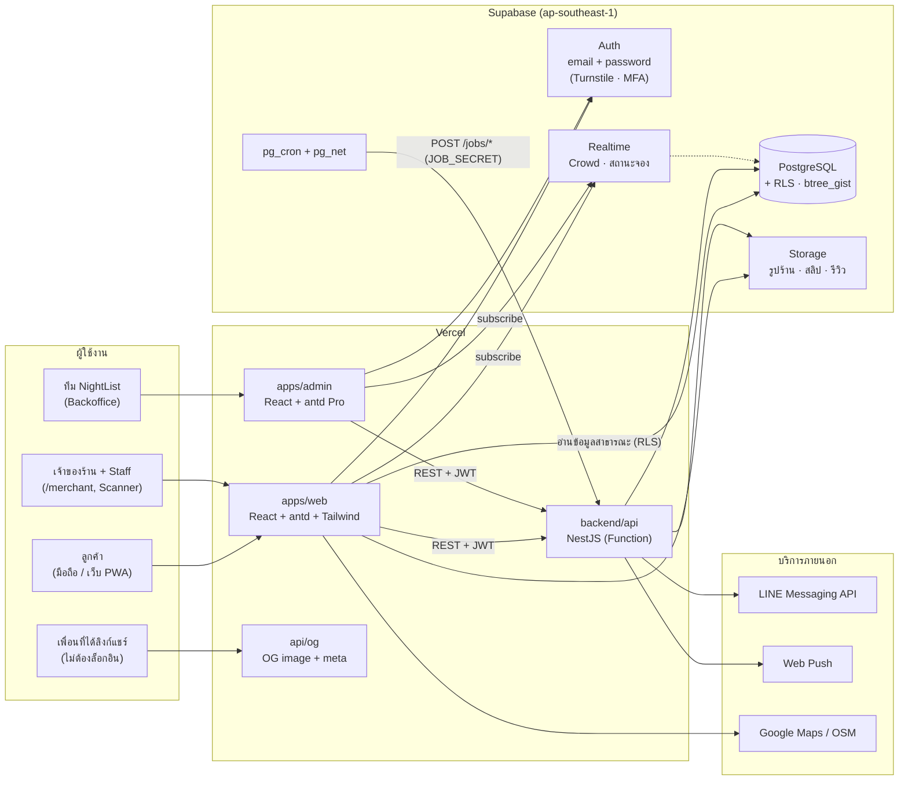
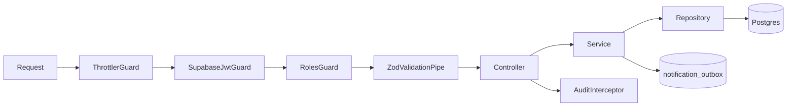
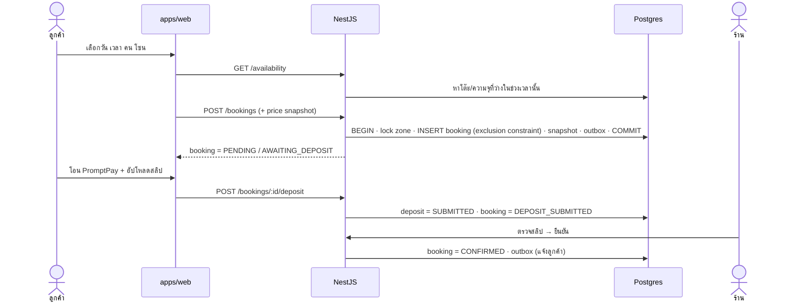
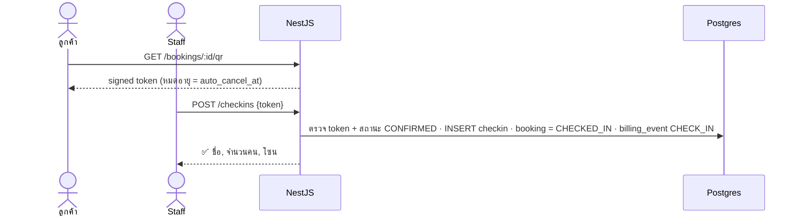
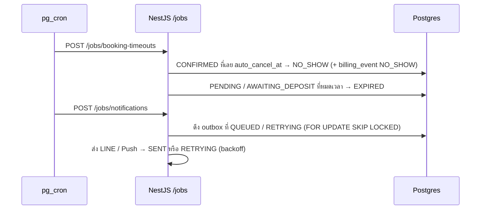
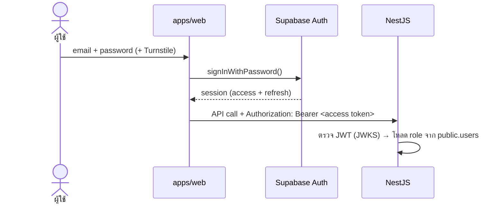

# NightList — Architecture

> สถานะ: **Draft v0.3** · ใช้คู่กับ [`PROMPT.md`](PROMPT.md) (สเปค) และ [`SITEMAP.md`](SITEMAP.md) (หน้าเว็บ)

## 1. ภาพรวมระบบ



**หลักคิด 4 ข้อ**
1. **เขียนผ่าน API เท่านั้น:** การจอง สถานะ เช็กอิน มัดจำ ค่าคอม และโปรโมท ต้องผ่าน NestJS ทุกครั้ง เพื่อให้มีการตรวจกฎธุรกิจและ transaction ครบ
2. **อ่านตรงได้:** รายชื่อร้าน เมนู รีวิว และ Realtime ให้ frontend อ่านจาก Supabase ตรงโดยมี RLS คุม เพื่อลดภาระของ API
3. **Serverless-friendly:** NestJS บน Vercel ไม่ถืองานค้างไว้เอง งานตั้งเวลาทั้งหมดให้ `pg_cron` เป็นตัวเรียก
4. **โค้ดกฎธุรกิจชุดเดียว:** ตารางเปลี่ยนสถานะ ตัวคำนวณราคา และตัวคำนวณดาว อยู่ใน `packages/utils` แล้วใช้ร่วมกันทั้ง frontend และ backend

---

## 2. Layers

| Layer | อยู่ที่ | หน้าที่ |
|---|---|---|
| Presentation | `apps/web`, `apps/admin` | UI, routing, state ฝั่ง client และ form validation |
| Shared UI / Contract | `packages/ui`, `packages/types` | theme tokens, คอมโพเนนต์ร่วม, Zod schema / DTO |
| Domain logic (pure) | `packages/utils` | price calculator, star → tier, status transition map |
| API | `backend/api` | controller, guard, pipe, Swagger |
| Application / Domain | `backend/services` | booking, billing, notification ฯลฯ (NestJS modules) |
| Data | `backend/database` | migrations, RLS, DB functions, seed |
| Infra | `infra/terraform`, `.github/workflows` | Vercel, Supabase, secrets, CI/CD |

---

## 3. Frontend (`apps/web`, `apps/admin`)

### Stack
- React 19 + TypeScript + Vite + React Router
- **antd v6** เป็นคอมโพเนนต์หลักทั้ง 2 แอป (`apps/admin` ใช้ ProComponents เพิ่ม)
- **Tailwind CSS** ใช้กับ layout / spacing / responsive / ตัวตกแต่ง (gradient, glow) เท่านั้น ไม่ใช้สร้างคอมโพเนนต์ซ้ำกับ antd
- **Phosphor Icons** (`@phosphor-icons/react`) ใช้ทั้งหมด รวมถึงดาวคะแนน (`<Star weight="fill" />`)
- TanStack Query (server state), Zustand (UI state เล็กๆ เช่น bottom sheet และตัวกรอง), Motion

### antd + Tailwind อยู่ร่วมกันยังไง
- `ConfigProvider` ตัวเดียวที่ root ใส่ Midnight Gold token และ `darkAlgorithm` / `defaultAlgorithm`
- ใช้ `StyleProvider layer` ของ antd ร่วมกับ Tailwind v4 `@layer` โดยลำดับคือ `theme, base, antd, components, utilities` เพื่อไม่ให้ Tailwind preflight ไปทับ antd
- สีทั้งหมดมาจาก `packages/ui/tokens.ts` ไฟล์เดียว แล้วสร้างทั้ง **antd theme** และ **Tailwind CSS variables** จากไฟล์นี้
- ห้าม override `.ant-*` แบบ global ให้ใช้ token → component token → `classNames` / `styles` ตามลำดับ

### โครงภายในแอป (feature-based)
```
apps/web/src/
├── app/            # providers (Theme, antd ConfigProvider, QueryClient, Auth), router
├── routes/         # 1 ไฟล์ต่อ 1 หน้า (ตาม SITEMAP.md) — บาง, แค่ประกอบ feature
├── features/
│   ├── ranking/    # components/ hooks/ api.ts
│   ├── search/
│   ├── bar-detail/
│   ├── booking/
│   ├── deposit/
│   ├── checkin/
│   ├── review/
│   ├── favorite/
│   ├── auth/
│   └── merchant/   # dashboard, tonight, menu, tables, promote ...
├── shared/         # components ที่ใช้ข้าม feature, hooks, lib/api-client.ts
└── main.tsx
```
- **API client** สร้างจาก OpenAPI ของ NestJS (`openapi-typescript`) เพื่อให้ type ตรงกับ backend เสมอ
- **Guard ของ route** (`RequireAuth`, `RequireRole`) ห่อที่ระดับ layout route ใน React Router

### Component style — ✅ Function component + hooks
- เขียนทุก component เป็น function + hooks ตาม standard React (antd, TanStack Query, React Router และ Motion ออกแบบมาให้ใช้แบบนี้)
- **ไม่ใช้ class component** ยกเว้น `ErrorBoundary` (React ยังต้องเขียนเป็น class)
- **HOC** ใช้เฉพาะเรื่องที่ครอบหลายหน้า เช่น `withErrorBoundary` ส่วนเรื่องสิทธิ์ใช้ layout route `<RequireAuth>` / `<RequireRole role="MERCHANT">`
- logic ที่ใช้ซ้ำให้แยกเป็น custom hook เช่น `useBooking(id)`, `useAvailability(...)`, `useThemeMode()`

---

## 4. Backend (`backend/api` + `backend/services`)

### Request pipeline


### NestJS modules
| Module | รับผิดชอบ |
|---|---|
| `auth` | ตรวจ Supabase JWT, โหลด user + role, `@Roles()` decorator |
| `bars` | ข้อมูลร้าน, เวลาเปิด-ปิด, styles, links, media, safety |
| `menu` / `pricing` | เมนู, ค่าธรรมเนียม, แพ็กเกจ, ตัวประเมินราคา |
| `availability` | คำนวณโต๊ะว่างจาก reservation interval |
| `booking` | สร้างการจอง (transaction + overlap), state machine, snapshot |
| `deposit` | รับสลิป, อ่าน QR ในสลิป, ร้านยืนยัน/ปฏิเสธ |
| `checkin` | ออก QR token (signed JWT ใช้ครั้งเดียว) และสแกน |
| `review` | สร้าง/แก้รีวิว, รายงาน, moderation |
| `ranking` | คำนวณคะแนน → ดาว → Tier |
| `promotion` | แพ็กเกจโปรโมท, สลิป, ช่องที่ว่าง |
| `billing` | commission rules, billing events (CHECK_IN / NO_SHOW) |
| `notification` | outbox → LINE / Web Push / In-app + retry |
| `jobs` | endpoint `/jobs/*` ให้ pg_cron เรียก |
| `audit` | บันทึก audit log |

### การเข้าถึงฐานข้อมูล
- NestJS ต่อ Postgres ตรงผ่าน **Supavisor (transaction mode)** และใช้ **Kysely** + type ที่ generate จาก schema
  - เหตุผล: การจองต้องใช้ transaction + `SELECT … FOR UPDATE` ซึ่ง `supabase-js` ทำไม่ได้
- ใช้ `supabase-js` (service role) เฉพาะงาน Storage และ Auth admin
- ตรวจสิทธิ์ใน service ทุกครั้ง (เช่น ร้านแก้ได้เฉพาะร้านตัวเอง) ไม่พึ่ง RLS อย่างเดียว

---

## 5. Flow หลัก

### 5.1 จองโต๊ะ + มัดจำ


### 5.2 เช็กอินด้วย QR


### 5.3 งานตั้งเวลา (ทุก 1 นาที)


---

## 6. Auth & Security
- **วิธีล็อกอิน:** **email + password** ของ Supabase Auth (ไม่มี OTP / social login) frontend เรียก supabase-js ตรง และ NestJS แค่ตรวจ JWT ด้วย JWKS


- **สมัคร:** `signUp()` → trigger สร้าง `public.users` → ยืนยันอีเมลก่อนจอง
- **ป้องกันการเดารหัส:** rate limit ของ Supabase Auth + Turnstile CAPTCHA + Leaked Password Protection
- **Staff:** เจ้าของร้านเชิญทางอีเมล (`inviteUserByEmail` ผ่าน NestJS) · **Admin:** บังคับ TOTP MFA (AAL2)
- **Role:** เก็บที่ `users.role` (CUSTOMER / MERCHANT / STAFF / ADMIN) และ `bar_staff` สำหรับผูก Staff กับร้าน
- **RLS:** เปิดทุกตาราง
  - อ่านสาธารณะได้เฉพาะข้อมูลร้านที่ `APPROVED`
  - ข้อมูลส่วนตัวอ่านได้เฉพาะเจ้าของ
- **Admin:** `apps/admin` อยู่แยกโดเมน ต้องเป็น role ADMIN และต้องเปิด MFA
- **Secrets:** เก็บใน Vercel env / Terraform (sensitive) ห้าม commit
- **ไฟล์สลิป:** ใช้ Storage bucket แบบ private เปิดดูผ่าน signed URL อายุสั้น และลบตาม retention policy

---

## 7. Environments & Deploy

| Env | Vercel | Supabase | Deploy |
|---|---|---|---|
| dev | preview ต่อ PR | `nightlist-dev` | อัตโนมัติทุก PR |
| staging | `staging.*` | `nightlist-staging` | merge เข้า `main` |
| prod | `nightlist.app`, `admin.`, `api.` | `nightlist-prod` | manual approval |

**Pipeline:** `lint → test → build → terraform plan/apply → supabase db push → vercel deploy`

---

## 8. Monorepo
- **pnpm** workspaces + Turborepo
- โครงโฟลเดอร์ดูใน [`README.md`](../README.md) หรือ [`PROMPT.md`](PROMPT.md)
- Dependency ต้องไหลทางเดียว: `apps/*` → `packages/*` และ `backend/api` → `backend/services` → `backend/database` / `packages/*` (ห้ามย้อนกลับ)

---

## 9. การตัดสินใจ (ADR-lite)

| # | เรื่อง | ตัดสินใจ | สถานะ |
|---|---|---|---|
| 1 | UI library | antd v6 ทั้ง web และ admin + Tailwind สำหรับ layout/ตกแต่ง | ✅ |
| 2 | Icons | Phosphor (`@phosphor-icons/react`) | ✅ |
| 3 | Package manager | pnpm | ✅ |
| 4 | DB access ใน NestJS | Kysely + Supavisor | 🟡 เสนอ |
| 5 | Jobs | pg_cron → `/jobs/*` | ✅ |
| 6 | Component style | Function component + hooks (standard React) และ HOC เฉพาะ cross-cutting | ✅ |
| 7 | วิธีล็อกอิน | email + password (Supabase Auth) + Turnstile และ MFA สำหรับ Admin | ✅ |
